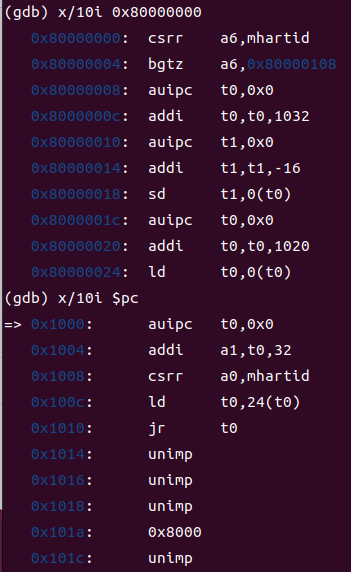
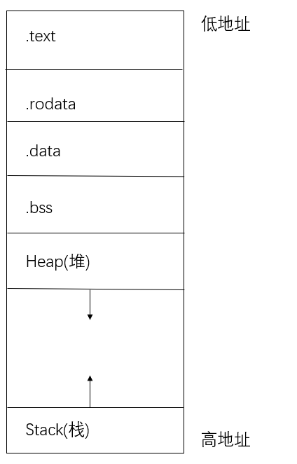
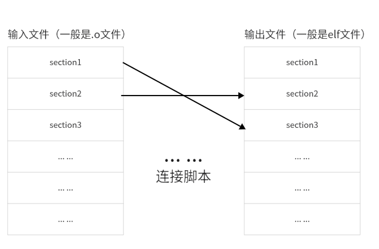
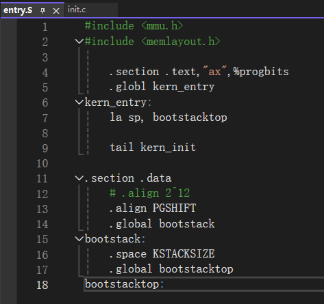
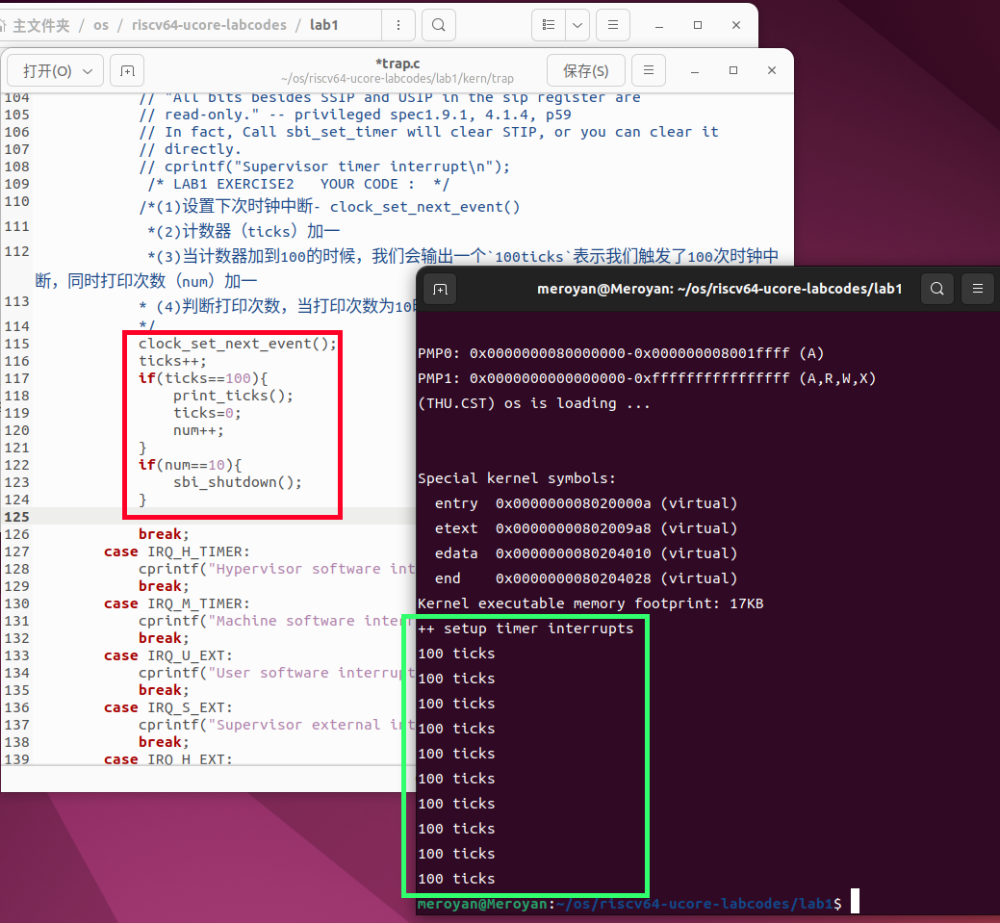
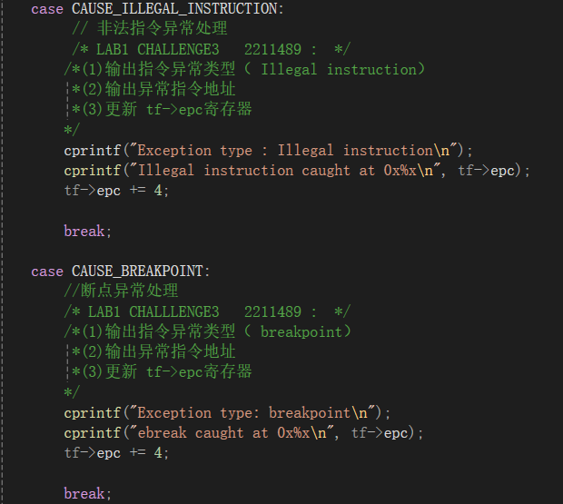

# Lab0.5 & Lab1 实验报告

#### Lab0.5-使用gdb调试QEMU模拟的RISC-V计算机加电开始运行到执行应用程序的第一条指令（即跳转到0x80200000）这个阶段的执行过程，说明RISC-V硬件加电后的几条指令在哪里？完成了哪些功能？

1. 在Lab0的文件夹打开终端，执行make debug，打开另一个终端，执行make gdb指令。
   通过x/10i 0x80000000 : 显示 0x80000000 处的10条汇编指令。
   使用x/10i $pc : 显示即将执行的10条汇编指令。
   
   当前pc位于0x1000处，即复位地址为0x1000（而不是0x80000000）。
   逐句分析这段汇编指令。
   **auipc t0, 0x0**为将立即数 0x0 扩展到32位并加到当前指令地址的高20位上，将结果存储在寄存器t0中。此时 t0 的值是0x1000。
   **addi t0, t0, 32**为将寄存器 t0 中的值和立即数 32 相加，并把结果存储在寄存器 a1 中。此时 a1 的值是0x1020。
   **csrr a0, mhartid**为读取控制和状态寄存器（CSR）中的 mhartid 寄存器的值，并将结果存储在寄存器 a0 中。
   使用info r a6: 显示 a6 寄存器的值。
   
   此时a0的值为0。
   **ld t0, 24(t0)**将地址为 t0 加上偏移量 24 的内存内容加载到目标寄存器 t0 中。此时 t0 的值是0x80000000。
   **jr t0**跳转到t0。
   这段代码完成了将PC寄存器跳转到 0x80000000 处。0x80000000 处通过 QEMU 自带的 bootloader--OpenSBI 固件，将两个文件被加载到 Qemu 的物理内存中：即作为 bootloader 的 OpenSBI.bin 被加载到物理内存以物理地址 0x80000000 开头的区域上，同时内核镜像 os.bin 被加载到以物理地址 0x80200000 开头的区域上。
2. 功能：
   （1） **加电**：计算机系统被加电，开始供电。
   （2） **复位**：在硬件上，计算机的处理器（ CPU ）通常会处于复位状态。在复位状态下，CPU 的程序计数器（PC）被设置为一个特定的复位地址。
   （3） **初始化内存**：对内存进行初始化，将内存区域的字节清零。
   （4） **加载操作系统**：BootLoader 将操作系统加载到内存中并启动它。
   （5）**跳转到程序入口点**：硬件通过执行跳转指令，将控制权转移到应用程序的入口点 0x80200000 继续执行。

#### **Lab0.5-重要知识点**
1. **bootloader：**
   在操作系统执行前，需要bootloader（在QEMU模拟的riscv计算机里，OpenSBI固件为bootloader）开机并将OS加载到内存里，然后将CPU的控制权交给操作系统（“功成身退”）。
   
2. **elf与bin：**
   elf文件比较复杂，使用elf header指定各段信息，需要解析才能知道文件内容。
   bin文件只是在文件头后简单的解释自己应该被加载到什么起始位置。
   因此，bin文件更适合在QEMU中执行使用。

3. **程序内存划分：**
   一种典型的内存布局如下图所示。
   

4. **链接脚本：**
   链接器的功能如下图所示，描述了怎样把输入文件的section映射到输出文件的section, 同时规定这些section的内存布局。
   

#### Lab1-理解内核启动中的程序入口操作
**阅读 kern/init/entry.S内容代码，结合操作系统内核启动流程，说明指令 la sp, bootstacktop 完成了什么操作，目的是什么？ tail kern_init 完成了什么操作，目的是什么？**

>kern/init/entry.S: OpenSBI启动之后将要跳转到的一段汇编代码。在这里进行内核栈的分配，然后转入C语言编写的内核初始化函数。
1. la sp, bootstacktop指令将bootstacktop的地址存入栈指针寄存器sp中。
   bootstacktop 指向内核启动时（boot）为内核栈（stack）分配的内存区域的顶部（top）。
   通过设置sp，确保了后续栈空间的正确使用。
2. kern_init是内核初始化函数。
   tail kern_init指令实现了kern_init函数的跳转，完成其他初始化工作。

#### Lab1-完善中断处理 （需要编程）

**编程完善trap.c中的中断处理函数trap，在对时钟中断进行处理的部分填写kern/trap/trap.c函数中处理时钟中断的部分，使操作系统每遇到100次时钟中断后，调用print_ticks子程序，向屏幕上打印一行文字”100 ticks”，在打印完10行后调用sbi.h中的shut_down()函数关机。**

**要求完成问题1提出的相关函数实现，提交改进后的源代码包（可以编译执行），并在实验报告中简要说明实现过程和定时器中断处理的流程。**

完善的代码部分见下图红框，运行结果图见下图绿框。

1. **实现过程：**
   （1）因为OpenSBI提供的接口一次只能设置一个时钟中断事件，所以一开始只设置一个时钟中断，之后每次发生时钟中断的时候，使用clock_set_next_event()函数设置下次的时钟中断；
   （2）每次时钟中断发生时，计数器ticks加一；
   （3）当ticks达到100时，使用print_ticks() 函数打印“100 ticks”到屏幕上，并讲ticks重置为0，打印次数（num）加一；
   （4）当num为10时，调用<sbi.h>中的关机函数sbi_shutdown()进行关机。

2. **定时器中断处理的流程**
   （1）触发中断时，会先保存当前执行流的上下文；
   （2）通过函数调用，切换到中断处理函数的上下文；
   （3）执行中断处理函数；
   （4）处理完中断后，恢复之前的执行状态。

#### Lab1-描述与理解中断流程

**描述ucore中处理中断异常的流程（从异常的产生开始），其中mov a0，sp的目的是什么？ SAVE_ALL中寄存器保存在栈中的位置是什么确定的？ 对于任何中断，__alltraps 中都需要保存所有寄存器吗？请说明理由。**

1. **ucore中处理中断异常的流程**
   （1）发生中断异常时，先保存CPU的寄存器到内存栈中；
   （2）跳转到中断处理函数，对中断处理/异常处理的工作进行分发，根据中断或异常的不同类型进行处理；
   （3）处理完成后，从内存栈中，恢复CPU的寄存器。

2. **mov a0，sp的目的**
   >按照RISCV calling convention, a0寄存器传递参数给接下来调用的函数trap。
   trap是trap.c里面的一个C语言函数，也就是我们的中断处理程序。
   
   将栈顶指针sp赋给寄存器a0，以便在中断处理完成后，恢复上下文。

3. **SAVE_ALL中寄存器保存在栈中的位置的确定方法**
   （1）**addi sp, sp, -36** 指令让栈顶指针向低地址空间延伸36个寄存器（32个通用寄存器+4个与中断有关的CSR）的空间；
   （2）在开辟的空间中，依次保存32个通用寄存器

4. **对于任何中断，__alltraps 中都需要保存所有寄存器吗？**
   需要，在中断处理完成后，需要恢复原进程的上下文，若不保存所有寄存器，可能会导致上下文信息不完整，从而无法正确恢复。

#### Lab1-理解上下文切换机制

**在trapentry.S中汇编代码 csrw sscratch, sp；csrrw s0, sscratch, x0实现了什么操作，目的是什么？save all里面保存了stval scause这些csr，而在restore all里面却不还原它们？那这样store的意义何在呢？**

1. **csrw sscratch, sp；csrrw s0, sscratch, x0实现的操作与目的**
   （1）**csrw sscratch, sp** 指令保存原先的栈顶指针sp到sscratch。因为后续要移动栈顶指针以开辟新的空间，因此需要记录当前栈顶指针的值，以便中断处理完成后还原。
   >约定：若中断前处于S态，sscratch为0；若中断前处于U态，sscratch存储内核栈地址。
   
   因此，也可以通过sscratch的数值判断是内核态产生的中断还是用户态产生的中断。

   （2）**csrrw s0, sscratch, x0**指令将sscratch的值存储到寄存器s0中，并将寄存器x0的值存储到系统寄存器sscratch中。
   通过设置当前sscratch的值为0，可以确定当前中断处于内核态。
   确保在嵌套中断处理时，可以正确恢复上下文。

2. **save all里面保存了stval、scause这些csr，而在restore all里面却不还原它们？那这样store的意义何在呢？**
   （1）**stval**会记录一些中断处理所需要的辅助信息，比如指令获取(instruction fetch)、访存、缺页异常，它会把发生问题的目标地址或者出错的指令记录下来，这样我们在中断处理程序中就知道处理目标了；
   **scause**会记录中断发生的原因，还会记录该中断是不是一个外部中断。
   stval、scause在中断处理时会被用到。
   根据stval、scause中的信息，将工作分发给了interrupt_handler()，exception_handler(), 这些函数再根据中断或异常的不同类型来处理。

   （2）在异常处理完成后，处理器会从异常处理流程中返回到原始的程序流程。如果还原这些 csr 寄存器的值，会导致处理器再次进入异常状态，从而引发重复的异常处理逻辑，无法正常返回到原始的程序流程。

#### Lab1-完善异常中断

**编程完善在触发一条非法指令异常 mret和，在 kern/trap/trap.c的异常处理函数中捕获，并对其进行处理，简单输出异常类型和异常指令触发地址，即“Illegal instruction caught at 0x(地址)”，“ebreak caught at 0x（地址）”与“Exception type:Illegal instruction"，“Exception type: breakpoint”。**

1. 在init里通过内联汇编加入非法指令和断点指令。
   

2. 完善trap.c代码。
   

3. 运行结果。
   

#### **Lab1-重要知识点**