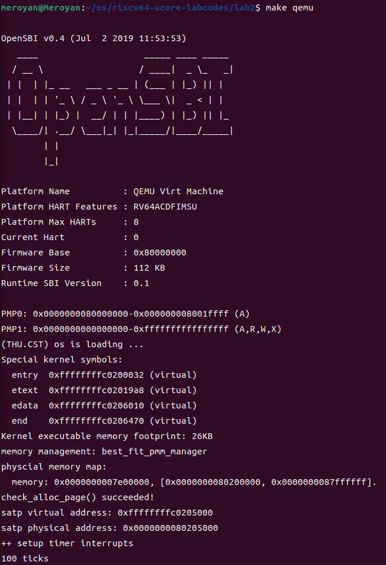
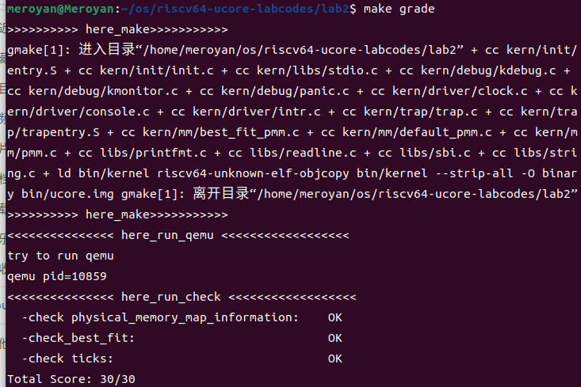

# Lab2 实验报告

### 练习0：填写已有实验

本实验依赖实验1。请把你做的实验1的代码填入本实验中代码中有“LAB1”的注释相应部分并按照实验手册进行进一步的修改。具体来说，就是跟着实验手册的教程一步步做，然后完成教程后继续完成完成exercise部分的剩余练习。


### 练习1：理解first-fit 连续物理内存分配算法（思考题）
**first-fit 连续物理内存分配算法作为物理内存分配一个很基础的方法，需要同学们理解它的实现过程。请大家仔细阅读实验手册的教程并结合`kern/mm/default_pmm.c`中的相关代码，认真分析default_init，default_init_memmap，default_alloc_pages， default_free_pages等相关函数，并描述程序在进行物理内存分配的过程以及各个函数的作用。**
**请在实验报告中简要说明你的设计实现过程。请回答如下问题：**
- **你的first fit算法是否有进一步的改进空间？**

>First Fit算法就是当需要分配页面时，它会从空闲页块链表中找到第一个适合大小的空闲页块，然后进行分配。当释放页面时，它会将释放的页面添加回链表，并在必要时合并相邻的空闲页块，以最大限度地减少内存碎片。

1. **物理内存分配的过程**
  对记录空闲物理内存的列表进行初始化，在列表中进行遍历，找到第一个满足请求大小的块，并根据情况进行分割，将剩余的块重新链接至列表中；释放内存，与相邻地址块合并。

2. **各个函数的作用**
 **default_init:** 初始化空闲内存块列表free_list为空链表，并将空闲块数量nr_free初始化为0。
 **default_init_memmap：** 初始化每一个空闲页，若当前页为块的第一页，则设置其property为块的总页数n，否则设置为0。更新nr_free，然后将其按照地址由低到高，在free_list中找寻合适位置并链接。
 **default_alloc_pages：** 遍历free_list，找到第一个块大小大于请求大小的块，将其分配出来。如果需要裁剪，则将剩余的部分重新加入至free_list中。并更新nr_free。
 **default_free_pages：** 释放页面，按照地址由低到高插入到free_list中。尝试与相邻的地址块进行合并。

3. **改进空间**
  First-Fit分配策略是寻找第一个块大小大于请求大小的块（记为块a），容易造成低地址部分的块碎片过多。
  如果存在块大小恰巧等于请求大小的块（记作块b），将块b分配出去的效果明显优于将块a分配出去。但如果块b的地址比块a高，按照First-Fit分配策略，将错过更为合适的块b，导致低地址内存碎片增加。


### 练习2：实现 Best-Fit 连续物理内存分配算法（需要编程）

**在完成练习一后，参考kern/mm/default_pmm.c对First Fit算法的实现，编程实现Best Fit页面分配算法，算法的时空复杂度不做要求，能通过测试即可。**
**请在实验报告中简要说明你的设计实现过程，阐述代码是如何对物理内存进行分配和释放，并回答如下问题：**
- **你的 Best-Fit 算法是否有进一步的改进空间？**


**实现过程：** 与First-Fit不同，Best-Fit的设计思路是找到物理内存中，内存块大小最接近请求快大小的那个空闲块。
best_fit_init，best_fit_alloc_pages，best_fit_free_pages，函数与First-Fit中函数的算法、作用相同，再次不再重复。
仅对best_fit_alloc_pages函数中，遍历空闲链表，找到符合要求的空闲块的代码进行简介。
```cpp{.line-numbers}
best_fit_alloc_pages(size_t n) {
    assert(n > 0);
    if (n > nr_free) {
        return NULL;
    }
    struct Page* page = NULL;
    list_entry_t* le = &free_list;
    size_t min_size = (size_t)-1;
    /*LAB2 EXERCISE 2: 2211489*/
   // 下面的代码是first-fit的部分代码，请修改下面的代码改为best-fit
   // 遍历空闲链表，查找满足需求的空闲页框
   // 如果找到满足需求的页面，记录该页面以及当前找到的最小连续空闲页框数量
    while ((le = list_next(le)) != &free_list) {
        struct Page* p = le2page(le, page_link);
        if (p->property >= n && p->property < min_size)
        {
            page = p;
            min_size = p->property;
        }
    }

    if (page != NULL) {
        list_entry_t* prev = list_prev(&(page->page_link));
        list_del(&(page->page_link));
        if (page->property > n) {
            struct Page* p = page + n;
            p->property = page->property - n;
            SetPageProperty(p);
            list_add(prev, &(p->page_link));
        }
        nr_free -= n;
        ClearPageProperty(page);
    }
    return page;
}
```

在代码中，设置了一个当前符合要求的最小的空闲块min_size，并将其初始化为一个极大值。在遍历链表时，如果当前访问的块的大小大于请求大小，且小于记录的min_size，则记录当前页面，并更新min_size。这样在循环遍历完整个链表后，可以找到最小的符合要求的页面，避免分配的页面过大，造成过多的内存碎片。

运行结果如下图所示：

得分如下图所示：


**改进空间：** 可以考虑将链表改为按照块大小排序，在查找时使用二分查找，可以大大提高查找效率。
此外，还可以在对块进行分配时，检查是否可以合并相邻的空闲块，可以提高利用效率。

### 扩展练习Challenge：buddy system（伙伴系统）分配算法（需要编程）

Buddy System算法把系统中的可用存储空间划分为存储块(Block)来进行管理, 每个存储块的大小必须是2的n次幂(Pow(2, n)), 即1, 2, 4, 8, 16, 32, 64, 128...

 -  参考[伙伴分配器的一个极简实现](http://coolshell.cn/articles/10427.html)， 在ucore中实现buddy system分配算法，要求有比较充分的测试用例说明实现的正确性，需要有设计文档。
 
### 扩展练习Challenge：任意大小的内存单元slub分配算法（需要编程）

slub算法，实现两层架构的高效内存单元分配，第一层是基于页大小的内存分配，第二层是在第一层基础上实现基于任意大小的内存分配。可简化实现，能够体现其主体思想即可。

 - 参考[linux的slub分配算法/](http://www.ibm.com/developerworks/cn/linux/l-cn-slub/)，在ucore中实现slub分配算法。要求有比较充分的测试用例说明实现的正确性，需要有设计文档。


### 扩展练习Challenge：硬件的可用物理内存范围的获取方法（思考题）
  - 如果 OS 无法提前知道当前硬件的可用物理内存范围，请问你有何办法让 OS 获取可用物理内存范围？


> Challenges是选做，完成Challenge的同学可单独提交Challenge。完成得好的同学可获得最终考试成绩的加分。