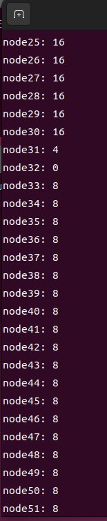

# Lab2 实验报告

### 练习0：填写已有实验

本实验依赖实验1。请把你做的实验1的代码填入本实验中代码中有“LAB1”的注释相应部分并按照实验手册进行进一步的修改。具体来说，就是跟着实验手册的教程一步步做，然后完成教程后继续完成完成exercise部分的剩余练习。

### 练习1：理解first-fit 连续物理内存分配算法（思考题）

**first-fit 连续物理内存分配算法作为物理内存分配一个很基础的方法，需要同学们理解它的实现过程。请大家仔细阅读实验手册的教程并结合`kern/mm/default_pmm.c`中的相关代码，认真分析default_init，default_init_memmap，default_alloc_pages， default_free_pages等相关函数，并描述程序在进行物理内存分配的过程以及各个函数的作用。**
**请在实验报告中简要说明你的设计实现过程。请回答如下问题：**

- **你的first fit算法是否有进一步的改进空间？**

>First Fit算法就是当需要分配页面时，它会从空闲页块链表中找到第一个适合大小的空闲页块，然后进行分配。当释放页面时，它会将释放的页面添加回链表，并在必要时合并相邻的空闲页块，以最大限度地减少内存碎片。

1. **物理内存分配的过程**
  对记录空闲物理内存的列表进行初始化，在列表中进行遍历，找到第一个满足请求大小的块，并根据情况进行分割，将剩余的块重新链接至列表中；释放内存，与相邻地址块合并。

2. **各个函数的作用**
 **default_init:** 初始化空闲内存块列表free_list为空链表，并将空闲块数量nr_free初始化为0。
 **default_init_memmap：** 初始化每一个空闲页，若当前页为块的第一页，则设置其property为块的总页数n，否则设置为0。更新nr_free，然后将其按照地址由低到高，在free_list中找寻合适位置并链接。
 **default_alloc_pages：** 遍历free_list，找到第一个块大小大于请求大小的块，将其分配出来。如果需要裁剪，则将剩余的部分重新加入至free_list中。并更新nr_free。
 **default_free_pages：** 释放页面，按照地址由低到高插入到free_list中。尝试与相邻的地址块进行合并。

3. **改进空间**
  First-Fit分配策略是寻找第一个块大小大于请求大小的块（记为块a），容易造成低地址部分的块碎片过多。
  如果存在块大小恰巧等于请求大小的块（记作块b），将块b分配出去的效果明显优于将块a分配出去。但如果块b的地址比块a高，按照First-Fit分配策略，将错过更为合适的块b，导致低地址内存碎片增加。

### 练习2：实现 Best-Fit 连续物理内存分配算法（需要编程）

**在完成练习一后，参考kern/mm/default_pmm.c对First Fit算法的实现，编程实现Best Fit页面分配算法，算法的时空复杂度不做要求，能通过测试即可。**
**请在实验报告中简要说明你的设计实现过程，阐述代码是如何对物理内存进行分配和释放，并回答如下问题：**

- **你的 Best-Fit 算法是否有进一步的改进空间？**

**实现过程：** 与First-Fit不同，Best-Fit的设计思路是找到物理内存中，内存块大小最接近请求快大小的那个空闲块。
best_fit_init，best_fit_alloc_pages，best_fit_free_pages，函数与First-Fit中函数的算法、作用相同，再次不再重复。
仅对best_fit_alloc_pages函数中，遍历空闲链表，找到符合要求的空闲块的代码进行简介。

```cpp{.line-numbers}
best_fit_alloc_pages(size_t n) {
    assert(n > 0);
    if (n > nr_free) {
        return NULL;
    }
    struct Page* page = NULL;
    list_entry_t* le = &free_list;
    size_t min_size = (size_t)-1;
    /*LAB2 EXERCISE 2: 2211489*/
   // 下面的代码是first-fit的部分代码，请修改下面的代码改为best-fit
   // 遍历空闲链表，查找满足需求的空闲页框
   // 如果找到满足需求的页面，记录该页面以及当前找到的最小连续空闲页框数量
    while ((le = list_next(le)) != &free_list) {
        struct Page* p = le2page(le, page_link);
        if (p->property >= n && p->property < min_size)
        {
            page = p;
            min_size = p->property;
        }
    }

    if (page != NULL) {
        list_entry_t* prev = list_prev(&(page->page_link));
        list_del(&(page->page_link));
        if (page->property > n) {
            struct Page* p = page + n;
            p->property = page->property - n;
            SetPageProperty(p);
            list_add(prev, &(p->page_link));
        }
        nr_free -= n;
        ClearPageProperty(page);
    }
    return page;
}
```

在代码中，设置了一个当前符合要求的最小的空闲块min_size，并将其初始化为一个极大值。在遍历链表时，如果当前访问的块的大小大于请求大小，且小于记录的min_size，则记录当前页面，并更新min_size。这样在循环遍历完整个链表后，可以找到最小的符合要求的页面，避免分配的页面过大，造成过多的内存碎片。

运行结果如下图所示：

得分如下图所示：


**改进空间：** 可以考虑将链表改为按照块大小排序，在查找时使用二分查找，可以大大提高查找效率。
此外，还可以在对块进行分配时，检查是否可以合并相邻的空闲块，可以提高利用效率。

### 扩展练习Challenge：buddy system（伙伴系统）分配算法（需要编程）

**Buddy System算法把系统中的可用存储空间划分为存储块(Block)来进行管理, 每个存储块的大小必须是2的n次幂(Pow(2, n)), 即1, 2, 4, 8, 16, 32, 64, 128...**

- **参考[伙伴分配器的一个极简实现](http://coolshell.cn/articles/10427.html)， 在ucore中实现buddy system分配算法，要求有比较充分的测试用例说明实现的正确性，需要有设计文档。**

1. **buddy system的设计思想。**
   - buddy system将系统中的内存按照2的n次幂进行划分，得到不同大小的块。使用空闲链表链接相同大小的空闲块。
   - 分配内存时，优先寻找大于等于所需大小并且最接近2的幂的块，如果找到，就分配出去；否则找寻更大的块，并将其对半切割。
   - 释放内存时，会寻找相邻的块，如果相邻块处于空闲状态，则与相邻块进行合并，并重复该过程，直到无法合并为止。
   - 在[伙伴分配器的一个极简实现](http://coolshell.cn/articles/10427.html)中，通过一个完全二叉树管理内存。

2. **代码实现**
（1）buddy_system_pmm.h

```cpp{.line-numbers}
#ifndef __KERN_MM_BUDDY_SYSTEM_PMM_H__
#define  __KERN_MM_BUDDY_SYSTEM_PMM_H__

#include <pmm.h>

extern const struct pmm_manager buddy_system_pmm_manager;

#endif /* ! __KERN_MM_BUDDY_SYSTEM_PMM_H__ */
 ```
  
（2）buddy_system_pmm.c

- **头文件与宏定义：**

```cpp{.line-numbers}
#include <pmm.h>
#include <list.h>
#include <string.h>
#include <buddy_system_pmm.h>
#include <default_pmm.h>
#include <stdio.h>


free_area_t free_area2;
#define free_list (free_area2.free_list)
#define nr_free (free_area2.nr_free)

struct Page* buddy_base;//buddy system的起始地址
unsigned* root;
int size;

#define LEFT_LEAF(index) ((index) * 2 + 1)  //左子树
#define RIGHT_LEAF(index) ((index) * 2 + 2) //右子树
#define PARENT(index) ( ((index) + 1) / 2 - 1)  //父节点
#define IS_POWER_OF_2(x) (!((x)&((x)-1)))   //是否为2的x次幂
#define MAX(a, b) ((a) > (b) ? (a) : (b))   //返回较大值
```

- **fixsize函数：** 计算大于或等于给定大小的最接近的2的幂。

```cpp{.line-numbers}
static unsigned fixsize(unsigned size) {    //调整为大于等于size的最接近的2的幂
    size |= size >> 1;
    size |= size >> 2;
    size |= size >> 4;
    size |= size >> 8;
    size |= size >> 16;
    return size + 1;
}
```

- **buddy_system_init函数：** 初始化伙伴系统内存管理器

```cpp{.line-numbers}
static void
buddy_system_init(void) {
    list_init(&free_list);
    nr_free = 0;
}
```

- **buddy_system_init_memmap函数：** 初始化内存映射表，设置二叉树的根节点

```cpp{.line-numbers}
static void
buddy_system_init_memmap(struct Page* base, size_t n) {
    assert(n > 0);
    struct Page* p = base;
    for (; p != base + n; p++) {
        assert(PageReserved(p));
        p->flags = p->property = 0;
        set_page_ref(p, 0);
    }
    base->property = n;
    SetPageProperty(base);
    nr_free += n;
    buddy_base = base;

    //size = fixsize(n);
    size = 256;
    //初始化二叉树
    unsigned node_size = 2 * size;
    root = (unsigned*)(base + size);
    for (int i = 0; i < 2 * size - 1; ++i)
    {
        if (IS_POWER_OF_2(i + 1))
            node_size /= 2;
        root[i] = node_size;
    }
}
```

- **buddy_system_alloc_pages函数：** 分配指定数量的连续页，并更新伙伴树中的信息

```cpp{.line-numbers}
static struct Page*
buddy_system_alloc_pages(size_t n) {
    assert(n > 0);
    if (n > nr_free) {
        return NULL;
    }
    struct Page* page = NULL;
    
    unsigned index = 0;
    unsigned node_size;
    unsigned offset = 0;

    if (n <= 0)
        n = 1;
    else if (!IS_POWER_OF_2(n))
    {
        n = fixsize(n);
    }
    if (root[index] < n)
        offset = -1;

    for (node_size = size; node_size != n; node_size /= 2) {
        if (root[LEFT_LEAF(index)] >= n)
            index = LEFT_LEAF(index);
        else
            index = RIGHT_LEAF(index);
    }
    root[index] = 0;
    offset = (index + 1) * node_size - size;
    while (index) {
        index = PARENT(index);
        root[index] = MAX(root[LEFT_LEAF(index)], root[RIGHT_LEAF(index)]);
    }

    unsigned x = fixsize(n);
    nr_free -= n;

    //开始分配的位置
    page = buddy_base + offset;
    //把分配出去的页面属性清除
    for (struct Page* p = page; p != page + x; p++)
        ClearPageProperty(p);

    page->property = n;

    return page;
}
```

- **buddy_system_free_pages函数：** 释放先前分配的连续页，并更新伙伴树中的信息

```cpp{.line-numbers}
static void
buddy_system_free_pages(struct Page* base, size_t n) {
    assert(n > 0);
    struct Page* p = base;
    n = fixsize(n);
    for (; p != base + n; p++) {
        assert(!PageReserved(p) && !PageProperty(p));
        set_page_ref(p, 0);
    }
    nr_free += n;

    unsigned offset = buddy_base - base;
    unsigned node_size = 1;
    unsigned index = size - offset - 1;
    unsigned left_longest, right_longest;

    for (; root[index]; index = PARENT(index)) {
        node_size *= 2;
        if (index == 0)
            return;
    }

    root[index] = node_size;
    
    while (index) {
        index = PARENT(index);
        node_size *= 2;

        left_longest = root[LEFT_LEAF(index)];
        right_longest = root[RIGHT_LEAF(index)];

        if (left_longest + right_longest == node_size)
            root[index] = node_size;
        else
            root[index] = MAX(left_longest, right_longest);
    }
}
```

- **buddy_system_nr_free_pages函数：** 返回当前系统中空闲页的数量

```cpp{.line-numbers}
static size_t
buddy_system_nr_free_pages(void) {
    return nr_free;
}
```

- **print_node函数：** 打印树中特定节点信息

```cpp{.line-numbers}
void print_node(int index)
{
    cprintf("node%d: %d\n", index, root[index]);
}
```

- **print_from_to函数：** 打印范围内的所有节点信息

```cpp{.line-numbers}
void print_from_to(int start, int end)
{
    for (int i = start; i <= end; i++)
        print_node(i);
    cprintf("\n");
}
```

- **buddy_system_check函数：** 用于测试内存管理器的功能是否正常工作

```cpp{.line-numbers}
static void
buddy_system_check(void) {
    cprintf("Starting buddy system memory checks...\n");

    // 进行内存分配测试
    struct Page* p1 = buddy_system_alloc_pages(3); // 分配3页
    struct Page* p2 = buddy_system_alloc_pages(8); // 分配8页
    struct Page* p3 = buddy_system_alloc_pages(9); // 分配9页

    cprintf("Allocated pages: p1 = %p, p2 = %p, p3 = %p\n", p1, p2, p3);
    
    // 打印当前Buddy树
    cprintf("Current Buddy Tree:\n");
    print_from_to(0, 80); // 从根节点开始打印树

    // 释放之前分配的页面
    if (p1) buddy_system_free_pages(p1, 3);
    if (p2) buddy_system_free_pages(p2, 8);
    if (p3) buddy_system_free_pages(p3, 9);

    // 打印当前Buddy树
    cprintf("Buddy Tree after deallocation:\n");
    print_from_to(0, 80); // 从根节点开始打印树

    // 再次分配页以验证内存状态
    struct Page* p4 = buddy_system_alloc_pages(127); // 分配127页
    cprintf("Allocated pages after deallocation: p4 = %p\n", p4);

    // 打印当前Buddy树
    cprintf("Buddy Tree after deallocation:\n");
    print_from_to(0, 80); // 从根节点开始打印树
}
```

3. 结果验证：

- 为了方便验证结果，我将树的根节点大小初始化为256
  - 在分配页面大小为3的p1时，先将其调整为4，然后进行分配，将第63节点分配出去，更新其值为0，并将第31节点的值更新为4，第15节点的值更新为8，第7节点的值更新为16，第3节点的值更新为32，第1节点的值更新为64，第0节点的值更新为128
  - 在分配页面大小为8的p2时，由于8是2的3次幂，无需调整，直接进行分配，应该将第32节点分配出去，更新其值为0，并将第15节点的值更新为4
  - 在分配页面大小为9的p1时，先将其调整为16，然后进行分配，将第16节点分配出去，更新其值为0，并将第7节点的值更新为4
  - 在完成三次分配后，当前树的节点状态应分别为：节点0-128，节点1-64，节点3-32，节点7-4，节点15-4，节点16-0，节点31-4，节点32-0，节点63-0
- 此时打印buddy树，结果如下图所示，可以看到节点的值符合刚刚分析的结果，证明分配无误</br>

 

  - 随后依次释放p1，p2，p3</br>


  - 分配页面大小为127的p4时，应将其调整为128，然后进行分配，将节点1分配出去，更新其值为0，更新其父节点节点0的值为128，打印当前树</br>


  - 打印完成后运行状态如下图所示</br>


- 基于以上测试用例，可以证明本次编写的buddy system算法实现的正确性。


### 扩展练习Challenge：任意大小的内存单元slub分配算法（需要编程）

**slub算法，实现两层架构的高效内存单元分配，第一层是基于页大小的内存分配，第二层是在第一层基础上实现基于任意大小的内存分配。可简化实现，能够体现其主体思想即可。**

**- 参考[linux的slub分配算法/](http://www.ibm.com/developerworks/cn/linux/l-cn-slub/)，在ucore中实现slub分配算法。要求有比较充分的测试用例说明实现的正确性，需要有设计文档。**

在内核中，**伙伴算法** 和 **SLUB算法** 协作用于不同大小的内存管理任务，以高效地管理大块和小块内存。

### 伙伴算法
**伙伴算法**以页（page）为单位管理内存。页面通常大小为4KB，是内存管理的基本单位。伙伴系统负责大块内存（整页或多页）的分配和管理。然而，大多数程序并不总是需要完整的4KB页内存，例如程序中常见的分配请求可能只需要几十字节或几百字节的小内存，因此需要另一种机制来管理这些小块内存。

### SLUB算法
**SLUB算法**用于小块内存的分配管理，运行在伙伴系统之上，为内核提供小内存的管理功能。SLUB通过向伙伴系统申请整页内存，将其划分成小块以便进一步管理和分配。

#### `kmalloc_caches`数组
SLUB系统中的小内存管理是通过 `kmalloc_caches[12]` 数组实现的。该数组包含12个 `kmem_cache` 结构体，每个结构体对应一种特定大小的内存分配单元（如 8B、16B、32B等）。可以将每个 `kmem_cache` 视为一个内存“零售商”，专门管理一种大小的内存块。整个SLUB系统共包含 12 种不同的内存大小，因此有 12 个“零售商”。

#### `kmem_cache`结构体
每个 `kmem_cache` 结构体作为一个“零售商”，包含两个主要部分：
   - **`kmem_cache_cpu`（营业厅）**：用于快速响应分配请求。营业厅只保留一个 slab（即一页或多页连续的内存块），当营业厅中内存不足时，会从仓库中获取新的 slab。
   - **`kmem_cache_node`（仓库）**：负责大块内存的存储，包含多个 slab，以备营业厅需要时调用。

#### Slab和Object的概念
**Slab**是 `kmem_cache` 从伙伴系统批量获取的一整块内存（例如一页或多页连续内存）。零售商会将 slab 划分成许多小块（即对象或object）进行“零售”。每个零售商管理的 slab 划分方式取决于内存块的大小，例如，8 字节大小的零售商会将 slab 划分为多个 8 字节的小块，满足特定大小的分配需求。每个 object 包含一个指向下一个 object 的指针，这些 object 的链表结构方便了快速的分配和回收。

### 内存申请流程
1. **首次申请**：当 SLUB 系统首次创建时，`kmem_cache_cpu`（营业厅）和 `kmem_cache_node`（仓库）都没有空闲的 slab。此时，SLUB 系统会向伙伴系统申请一个空闲页，将其划分成多个 object。返回第一个 object 给用户，同时将剩余的 object 标记为空闲并放入 `kmem_cache_cpu` 的 `freelist` 中（`freelist` 存储了下一个空闲 object 的地址）。

2. **连续申请**：随着内存的不断申请，`kmem_cache_cpu` 中的 slab 可能会被全部使用完，此时，SLUB 会从 `kmem_cache_node` 的 `partial` 链表中获取不满的 slab（包含空闲 object 的 slab），从中返回一个空闲的 object 给用户。
   - 当 `kmem_cache_cpu` 中的 slab 被完全使用时，会将该 slab 移至 `kmem_cache_node` 中。`kmem_cache_node` 包含两个双链表：`partial`（存储包含空闲 object 的 slab）和 `full`（存储已满的 slab）。SLUB 会优先从 `partial` 中获取不满的 slab，放入 `kmem_cache_cpu` 以便再次分配。

3. **向伙伴系统申请新页**：如果 `kmem_cache_cpu` 和 `kmem_cache_node` 中都没有可用的 object 时，SLUB 系统将向伙伴系统再次申请新的页，将该页初始化为 slab，返回第一个空闲的 object，`freelist` 指向下一个空闲 object。

### 内存释放流程
释放 object 时，根据 object 所在的 slab 的状态不同有不同的处理方式：
   - **`kmem_cache_cpu` 缓存的 slab**：如果释放的 object 所在的 slab 正被 `kmem_cache_cpu` 缓存，则直接将该 object 添加到空闲链表。
   - **`kmem_cache_node` 缓存的 slab**：如果释放的 object 所在的 slab 不在 `kmem_cache_cpu`，则需释放到对应的 slab 中，具体情况如下：
      - **slab 完全使用状态（full）**：若 slab 原本处于满（full）状态，释放一个 object 后变为部分空闲（partial），则需将该 slab 移至 `kmem_cache_node` 的 `partial` 链表中。
      - **slab 部分空闲状态（partial）**：若 slab 本就处于部分空闲状态，直接将 object 添加到 slab 的空闲链表中即可。
      - **slab 完全空闲状态**：若释放 object 后 slab 中所有 object 均为空闲，则将该 slab 从 `kmem_cache_node` 中释放掉，以节省不再需要的内存。

### 批发与零售的类比
SLUB系统中的 `kmem_cache` 可以看作是内存分配的**零售商**，它从伙伴系统（**批发商**）批量申请大块内存（如一页页申请），然后根据小内存需求将这些内存分割成特定大小的小块进行“零售”。


### 扩展练习Challenge：硬件的可用物理内存范围的获取方法（思考题）

**- 如果 OS 无法提前知道当前硬件的可用物理内存范围，请问你有何办法让 OS 获取可用物理内存范围？**


### 1. BIOS 或 UEFI 提供的内存信息
   现代计算机的 BIOS 或 UEFI 固件在启动时会为操作系统提供内存布局信息。这通常通过两种方式传递：

   - **通过 BIOS 提供的 `INT 15h` 中断调用**：在 x86 体系结构上，BIOS 可以通过 `INT 15h` 中断提供内存布局，操作系统可以调用它来获取系统内存范围和可用的内存段。
   - **通过 UEFI 提供的 EFI 系统表**：UEFI 固件通常提供一个内存映射，通过 `EFI_MEMORY_DESCRIPTOR` 结构描述系统的内存布局。操作系统在启动时可以通过 UEFI 服务函数来读取这些信息。

   操作系统可以通过读取这些信息来确定哪些物理内存段是可用的，哪些是保留给硬件设备或固件的。

### 2. 读取 ACPI 表
   另一个常见的方法是使用 ACPI（Advanced Configuration and Power Interface）提供的内存信息。ACPI 表中包含系统内存的布局和其他硬件资源。操作系统可以读取 ACPI 表中的 `SRAT`（System Resource Affinity Table）或者 `SPCR`（System Physical Address Map）等表，来获取详细的物理内存信息。

### 3. 探测内存边界
   某些操作系统在启动时可以通过内存探测的方式来确定物理内存的大小。这种方法通常依赖于硬件支持：

   - **逐页写入测试**：操作系统可以通过逐页尝试写入内存并检测是否发生异常，从而确定实际可用的内存范围。然而，这种方法效率较低，且需要处理不同硬件实现的内存管理特性。
   - **读取特定寄存器**：某些平台（如 ARM）可能会提供专门的硬件寄存器，记录系统中配置的物理内存大小，操作系统可以直接读取这些寄存器来获取内存范围。

### 4. 内存映射寄存器
   某些硬件平台上，主板或 CPU 可能会提供内存映射寄存器，用来记录物理内存的大小和布局。操作系统可以在启动时访问这些寄存器，获取系统中已安装的物理内存大小。

通过这些方法，操作系统可以有效地在启动过程中探测并确定可用物理内存的范围，从而为内存管理提供基础信息。