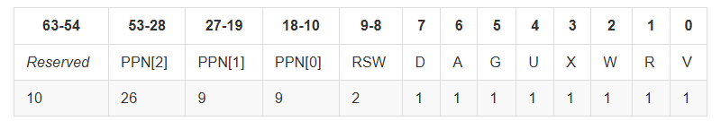
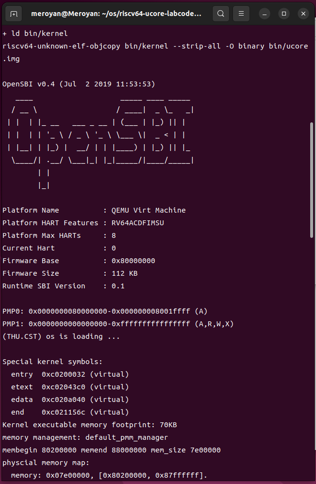
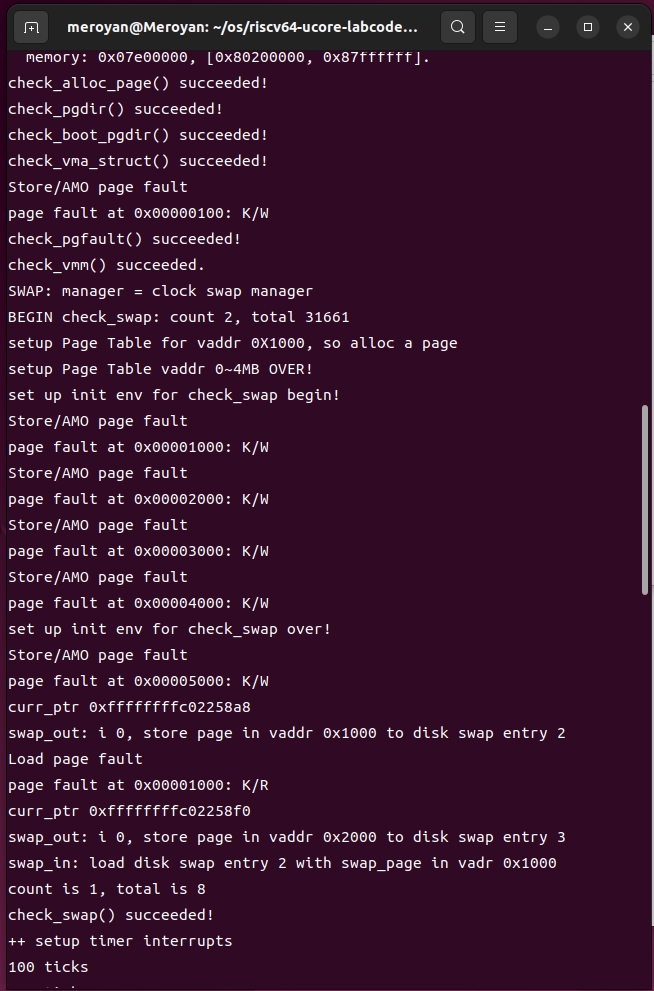
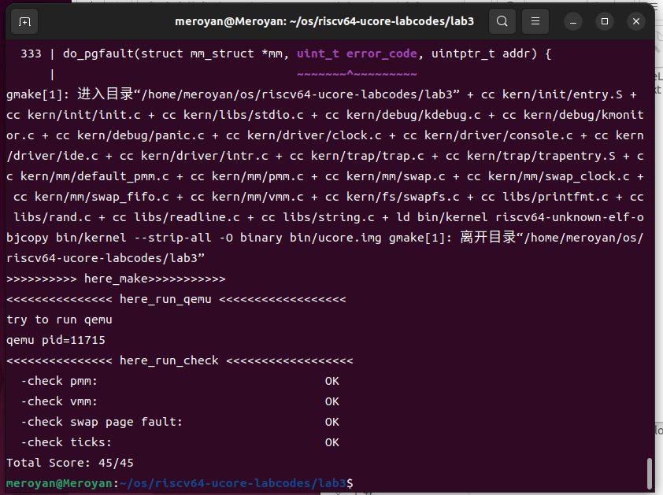

# Lab3 实验报告

#### 练习0：填写已有实验

本实验依赖实验1/2。请把你做的实验1/2的代码填入本实验中代码中有“LAB1”,“LAB2”的注释相应部分。

#### 练习1：理解基于FIFO的页面替换算法（思考题）

**描述FIFO页面置换算法下，一个页面从被换入到被换出的过程中，会经过代码里哪些函数/宏的处理（或者说，需要调用哪些函数/宏），并用简单的一两句话描述每个函数在过程中做了什么？（为了方便同学们完成练习，所以实际上我们的项目代码和实验指导的还是略有不同，例如我们将FIFO页面置换算法头文件的大部分代码放在了`kern/mm/swap_fifo.c`文件中，这点请同学们注意）**

- **至少正确指出10个不同的函数分别做了什么？如果少于10个将酌情给分。我们认为只要函数原型不同，就算两个不同的函数。要求指出对执行过程有实际影响,删去后会导致输出结果不同的函数（例如assert）而不是cprintf这样的函数。如果你选择的函数不能完整地体现”从换入到换出“的过程，比如10个函数都是页面换入的时候调用的，或者解释功能的时候只解释了这10个函数在页面换入时的功能，那么也会扣除一定的分数**

- 程序触发异常时，会先进入异常处理函数**exception_handler**，如果遇到的是缺页异常，则调用 pgfault_handler 函数来处理这个页面故障

- **pgfault_handler**函数会将相关信息传输给do_pgfault 函数，进行实际的处理

- **do_pgfault**函数首先调用find_vma函数，在mm_struct里判断这个虚拟地址是否合法，如果合法，则调用get_pte获取对应的页表项ptep，如果对应页表项不存在，则调用pgdir_alloc_page函数分配一个新的物理页并建立映射；如果存在，则使用swap_in函数与page_insert函数将其从磁盘加载到内存中，并使用swap_map_swappable函数建立映射关系。
  
  - **find_vma**函数在mm中查找虚拟地址addr对应的虚拟内存区域vma

  - **get_pte**根据给定的虚拟地址从页目录中获取相应的页表项ptep，如果对应页表项不存在，则为其分配一页

  - **pgdir_alloc_page**为给定的虚拟地址分配一个新的物理页面，并将页面插入到页表中

  - **swap_in**函数将页面从将磁盘读入内存

  - **page_insert**函数将物理页面映射到指定虚拟地址

  - **swap_map_swappable**函数将物理页面标记为可交换

- 在pgdir_alloc_page函数中，会首先调用alloc_pages函数分配物理页面，如果分配失败，则调用swap_out函数将页面换出
  - **alloc_pages**函数从物理内存中分配指定大小的页面

- **swap_out**函数中会调用swap_out_victim选择被换出的页面，并使用swapfs_write将页面写入磁盘，最后使用tlb_invalidate刷新tlb

- **_fifo_swap_out_victim**函数按照FIFO策略，选择最先进入的页面置换出去，并将其从队列中移除。

#### 练习2：深入理解不同分页模式的工作原理（思考题）

**get_pte()函数（位于`kern/mm/pmm.c`）用于在页表中查找或创建页表项，从而实现对指定线性地址对应的物理页的访问和映射操作。这在操作系统中的分页机制下，是实现虚拟内存与物理内存之间映射关系非常重要的内容。**

- **get_pte()函数中有两段形式类似的代码， 结合sv32，sv39，sv48的异同，解释这两段代码为什么如此相像。**

- sv32，sv39，sv48的异同
  - 三者均使用页表来映射虚拟地址到物理地址
  - sv32使用2级页表
  - sv39使用3级页表，页表项结构如下图所示
  - sv48使用4级页表



- get_pte函数中两段相似的代码的功能类似，分别处理的是2层页目录
  - 第一段代码处理的是第一层页目录：首先根据虚拟地址的高位，获取页目录项，然后检查其是否存在，如果不存在，则分配新的一页，并将其设置为页目录项
  - 第二段代码处理的是第二层页目录，内部逻辑与第一段类似

```cpp{.line-numbers}
    pde_t *pdep1 = &pgdir[PDX1(la)]; 
    if (!(*pdep1 & PTE_V)) {
        struct Page *page;
        if (!create || (page = alloc_page()) == NULL) {
            return NULL;
        }
        set_page_ref(page, 1);
        uintptr_t pa = page2pa(page);
        memset(KADDR(pa), 0, PGSIZE);
        *pdep1 = pte_create(page2ppn(page), PTE_U | PTE_V);
    }

    pde_t *pdep0 = &((pde_t *)KADDR(PDE_ADDR(*pdep1)))[PDX0(la)];
    if (!(*pdep0 & PTE_V)) {
     struct Page *page;
     if (!create || (page = alloc_page()) == NULL) {
      return NULL;
     }
     set_page_ref(page, 1);
     uintptr_t pa = page2pa(page);
     memset(KADDR(pa), 0, PGSIZE);
     *pdep0 = pte_create(page2ppn(page), PTE_U | PTE_V);
    }
```

- 如果使用sv32，则只需要使用一段代码；如果使用sv48，则需要使用三段代码

- **目前get_pte()函数将页表项的查找和页表项的分配合并在一个函数里，你认为这种写法好吗？有没有必要把两个功能拆开？**
我认为没必要将两个功能拆开。往往我们是因为需要使用该页表项，才会对页表项进行查找，在查找不到的时候自动分配，可以简化函数的调用。

#### 练习3：给未被映射的地址映射上物理页（需要编程）

**补充完成do_pgfault（mm/vmm.c）函数，给未被映射的地址映射上物理页。设置访问权限 的时候需要参考页面所在 VMA 的权限，同时需要注意映射物理页时需要操作内存控制 结构所指定的页表，而不是内核的页表。**
**请在实验报告中简要说明你的设计实现过程。请回答如下问题：**

- 补全后的do_pgfault函数代码如下：(其实指导书里面有)

```cpp{.line-numbers}
int
do_pgfault(struct mm_struct *mm, uint_t error_code, uintptr_t addr) {
    //初始化返回值为 -E_INVAL，表示无效的操作或参数。
    int ret = -E_INVAL;
    //try to find a vma which include addr
    struct vma_struct *vma = find_vma(mm, addr);

    pgfault_num++;
    //If the addr is in the range of a mm's vma?
    //未找到vma或vma越界，打印错误信息，goto failed
    if (vma == NULL || vma->vm_start > addr) {
        cprintf("not valid addr %x, and  can not find it in vma\n", addr);
        goto failed;
    }

    /* IF (write an existed addr ) OR
     *    (write an non_existed addr && addr is writable) OR
     *    (read  an non_existed addr && addr is readable)
     * THEN
     *    continue process
     */
    //设置权限位
    uint32_t perm = PTE_U;
    if (vma->vm_flags & VM_WRITE) {
        perm |= (PTE_R | PTE_W);
    }

    //地址向下对齐
    addr = ROUNDDOWN(addr, PGSIZE);

    ret = -E_NO_MEM;

    pte_t *ptep=NULL;

    //获取对应页表项
    ptep = get_pte(mm->pgdir, addr, 1);  //(1) try to find a pte, if pte's PT(Page Table) isn't existed, then create a PT.
    if (*ptep == 0) {
        //不存在，分配新页表
        if (pgdir_alloc_page(mm->pgdir, addr, perm) == NULL) {
            cprintf("pgdir_alloc_page in do_pgfault failed\n");
            goto failed;
        }
    } else {
        /*LAB3 EXERCISE 3: 2211489
        * 请你根据以下信息提示，补充函数
        * 现在我们认为pte是一个交换条目，那我们应该从磁盘加载数据并放到带有phy addr的页面，
        * 并将phy addr与逻辑addr映射，触发交换管理器记录该页面的访问情况
        *
        *  一些有用的宏和定义，可能会对你接下来代码的编写产生帮助(显然是有帮助的)
        *  宏或函数:
        *    swap_in(mm, addr, &page) : 分配一个内存页，然后根据
        *    PTE中的swap条目的addr，找到磁盘页的地址，将磁盘页的内容读入这个内存页
        *    page_insert ： 建立一个Page的phy addr与线性addr la的映射
        *    swap_map_swappable ： 设置页面可交换
        */

        if (swap_init_ok) {
            struct Page *page = NULL;

            // 你要编写的内容在这里，请基于上文说明以及下文的英文注释完成代码编写
            //(1）According to the mm AND addr, try
            //to load the content of right disk page
            //into the memory which page managed.
            //(2) According to the mm,
            //addr AND page, setup the
            //map of phy addr <--->
            //logical addr
            //(3) make the page swappable.
            //（1）根据mm和addr，从磁盘加载到内存
            //（2）根据mm和page，建立映射关系
            //（3）设置页面可交换
            
            swap_in(mm, addr, &page);
            //page_insert(pde_t *pgdir, struct Page *page, uintptr_t la, uint32_t perm)
            //page对应物理页面，la是虚拟地址
            page_insert(mm->pgdir, page, addr, perm);
            swap_map_swappable(mm, addr, page, 1);

            page->pra_vaddr = addr;
        } else {
            cprintf("no swap_init_ok but ptep is %x, failed\n", *ptep);
            goto failed;
        }
   }
   ret = 0;
failed:
    return ret;
}
```

- **请描述页目录项（Page Directory Entry）和页表项（Page Table Entry）中组成部分对ucore实现页替换算法的潜在用处。**


还是这张图，可以看到，页表项中后面的第 9-0 位描述了映射的状态信息。

>**RSW：** 两位留给 S Mode 的应用程序，我们可以用来进行拓展。
**D：** 即 Dirty ，如果 D=1 表示自从上次 D 被清零后，有虚拟地址通过这个页表项进行写入。
**A:** 即 Accessed，如果 A=1 表示自从上次 A 被清零后，有虚拟地址通过这个页表项进行读、或者写、或者取指。
**G:** 即 Global，如果 G=1 表示这个页表项是”全局"的，也就是所有的地址空间（所有的页表）都包含这一项
**U:** 即 user，U为 1 表示用户态 (U Mode)的程序 可以通过该页表项进映射。在用户态运行时也只能够通过 U=1 的页表项进行虚实地址映射。 注意，S Mode 不一定可以通过 U=1 的页表项进行映射。我们需要将 S Mode 的状态寄存器 sstatus 上的 SUM 位手动设置为 1 才可以做到这一点（通常情况不会把它置1）。否则通过 U=1 的页表项进行映射也会报出异常。另外，不论sstatus的SUM位如何取值，S Mode都不允许执行 U=1 的页面里包含的指令，这是出于安全的考虑。
**R,W,X** 为许可位，分别表示是否可读 (Readable)，可写 (Writable)，可执行 (Executable)。

借助这些位，可以实现多种页面置换算法。例如借助A位和D位，可以实现Enhanced Clock算法

- **如果ucore的缺页服务例程在执行过程中访问内存，出现了页访问异常，请问硬件要做哪些事情？**

回到lab1，出现页访问异常后，会触发中断进入 S 态进行处理时，以下寄存器会被硬件自动设置，将一些信息提供给中断处理程序：
>sepc(supervisor exception program counter)，它会记录触发中断的那条指令的地址；
scause，它会记录中断发生的原因，还会记录该中断是不是一个外部中断；
stval，它会记录一些中断处理所需要的辅助信息，比如指令获取(instruction fetch)、访存、缺页异常，它会把发生问题的目标地址或者出错的指令记录下来，这样我们在中断处理程序中就知道处理目标了。

在trap中判断该异常产生的原因并进行处理，如果是缺页异常，则根据异常信息找到缺失的页面，并将该页从磁盘中加载到内存中相应的位置，并更新页表项。（具体执行流程请看练习一的回答）

- **数据结构Page的全局变量（其实是一个数组）的每一项与页表中的页目录项和页表项有无对应关系？如果有，其对应关系是啥？**

每个页表项对应一个物理页，每个页目录项指向一个页表，一个页表包含多个页表项。

#### 练习4：补充完成Clock页替换算法（需要编程）

**通过之前的练习，相信大家对FIFO的页面替换算法有了更深入的了解，现在请在我们给出的框架上，填写代码，实现 Clock页替换算法（mm/swap_clock.c）。**
**请在实验报告中简要说明你的设计实现过程。请回答如下问题：**

- 初始化用于Clock算法的链表

```cpp{.line-numbers}
static int
_clock_init_mm(struct mm_struct *mm)
{     
     /*LAB3 EXERCISE 4: 2211489*/ 
     // 初始化pra_list_head为空链表
    list_init(&pra_list_head);
     // 初始化当前指针curr_ptr指向pra_list_head，表示当前页面替换位置为链表头
    curr_ptr = &pra_list_head;
     // 将mm的私有成员指针指向pra_list_head，用于后续的页面替换算法操作
    mm->sm_priv = &pra_list_head;
     //cprintf(" mm->sm_priv %x in fifo_init_mm\n",mm->sm_priv);
     return 0;
}
```

- 将新访问的页面加入到链表中，并设置访问标志位为1

```cpp{.line-numbers}
static int
_clock_map_swappable(struct mm_struct *mm, uintptr_t addr, struct Page *page, int swap_in)
{
    //record the page access situlation
    /*LAB3 EXERCISE 4: 2211489*/ 
    // link the most recent arrival page at the back of the pra_list_head qeueue.
    // 将页面page插入到页面链表pra_list_head的末尾
    list_entry_t* head = (list_entry_t*)mm->sm_priv;
    list_entry_t* entry = &(page->pra_page_link);
    assert(entry != NULL && head != NULL);
    list_add(head, entry);
    // 将页面的visited标志置为1，表示该页面已被访问
    page->visited = 1;
    return 0;
}
```

- 选择换出的页面
  - 首先获取链表头指针
  - 进入循环遍历，寻找换出页面

```cpp{.line-numbers}
static int
_clock_swap_out_victim(struct mm_struct *mm, struct Page ** ptr_page, int in_tick)
{
     list_entry_t *head=(list_entry_t*) mm->sm_priv;
         assert(head != NULL);
     assert(in_tick==0);
     while (1) {
         /*LAB3 EXERCISE 4: 2211489*/
         // 编写代码
         // 遍历页面链表pra_list_head，查找最早未被访问的页面
         //从链表尾向前遍历
         list_entry_t* entry = list_prev(head);//链表尾节点
         // 获取当前页面对应的Page结构指针
         struct Page* p = le2page(entry, pra_page_link);
         if (entry == head) {//到达头节点，再回尾节点
             entry = list_prev(head);
         }
         // 如果当前页面未被访问，则将该页面从页面链表中删除，并将该页面指针赋值给ptr_page作为换出页面
         if (p->visited == 0)
         {
             list_del(entry);
             *ptr_page = le2page(entry, pra_page_link);
             cprintf("curr_ptr %p\n", curr_ptr);    //打印
             break;

         }
         // 如果当前页面已被访问，则将visited标志置为0，表示该页面已被重新访问
         if (p->visited == 1)
         {
             p->visited = 0;
             curr_ptr = entry;
             entry = list_prev(entry);  //继续向前遍历
         }
     }
    return 0;
}
```

- 运行结果
  - make qemu
  
  
  - make grade


- **比较Clock页替换算法和FIFO算法的不同。**
FIFO算法按照页面进入内存的时间维护一个队列，每次选择换出的页面，是最早进入队列的页面，并不考虑页面是否被访问过，存在Belady现象。
而Clock通过引入访问位，维护一个双向链表，选择最近一段时间未被访问过的页面作为被换出的页面，避免Belady现象

#### 练习5：阅读代码和实现手册，理解页表映射方式相关知识（思考题）

**如果我们采用“一个大页” 的页表映射方式，相比分级页表，有什么好处、优势，有什么坏处、风险？**

- **优势：**
  - 只需要维护一个页表，便于管理与维护
  - 减少页表层级的访问，加快了对物理页的访问速度，提高访存性能

- **风险：**
  - 如果一个进程只需要一小部分内存，但系统需要使用一个“大页”来映射，剩余的内存空间未被充分利用，造成内存碎片
  - 一个大页中，未被用到的虚拟地址也被记载进了页表中，增大了内存开销

#### 扩展练习 Challenge：实现不考虑实现开销和效率的LRU页替换算法（需要编程）
