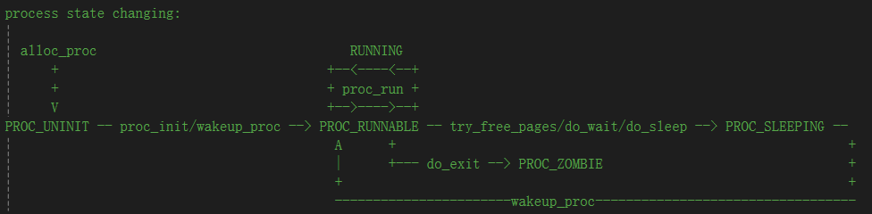
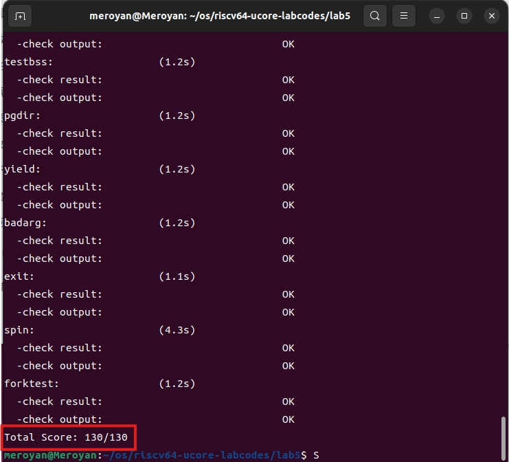

# Lab5 实验报告

### 练习0：填写已有实验

**本实验依赖实验2/3/4。请把你做的实验2/3/4的代码填入本实验中代码中有“LAB2”/“LAB3”/“LAB4”的注释相应部分。注意：为了能够正确执行lab5的测试应用程序，可能需对已完成的实验2/3/4的代码进行进一步改进。**'

- 在**alloc_proc**中，将lab4代码按照注释要求修改代码如下所示：

```cpp{.line-numbers}
        // 初始化进程结构体的各个字段
        proc->state = PROC_UNINIT;            // 初始状态为未初始化
        proc->pid = -1;                       // PID 未分配
        proc->runs = 0;                       // 运行次数为 0
        proc->kstack = 0;                     // 内核栈地址初始化为 0
        proc->need_resched = 0;           // 初始不需要重新调度
        proc->parent = NULL;                  // 父进程指针初始化为 NULL
        proc->mm = NULL;                      // 内存管理结构体指针初始化为 NULL

        // 初始化 context 字段
        memset(&proc->context, 0, sizeof(struct context));

        proc->tf = NULL;                      // 陷阱帧初始化为 NULL
        proc->cr3 = boot_cr3;                 // CR3 寄存器值初始化
        proc->flags = 0;                      // 进程标志初始化为 0

        // 初始化进程名称为一个空字符串
        memset(proc->name, 0, PROC_NAME_LEN + 1);

        // [新增]
        proc->wait_state = 0;
        proc->cptr = NULL;      // Child Pointer 表示当前进程的子进程
        proc->optr = NULL;      // Older Sibling Pointer 表示当前进程的上一个兄弟进程
        proc->yptr = NULL;      // Younger Sibling Pointer 表示当前进程的下一个兄弟进程
```

- 在**do_fork**中，将lab4代码按照注释要求修改代码如下所示：

```cpp{.line-numbers}
    // 分配进程结构体
    proc = alloc_proc();
    if (proc == NULL) {
        goto fork_out; // 分配进程结构失败
    }

    // [添加] 设置子进程的父进程为当前进程，确保当前进程的wait_state = 0
    proc->parent = current;
    assert(current->wait_state == 0);

    // 分配内核栈
    if (setup_kstack(proc) != 0) {
        goto bad_fork_cleanup_proc; // 分配内核栈失败
    }

    // 复制父进程的内存管理信息
    if (copy_mm(clone_flags, proc) != 0) {
        goto bad_fork_cleanup_proc;
    };

    // 设置新进程的中断帧和上下文
    copy_thread(proc, stack, tf);

    bool intr_flag;
    local_intr_save(intr_flag);//屏蔽中断，intr_flag置为1
    {
        proc->pid = get_pid();//获取当前进程PID
        hash_proc(proc); // 添加进程到哈希列表
        //list_add(&proc_list, &(proc->list_link));  // 添加进程到进程列表
        //nr_process++;

        // [添加] 设置进程关系的连接
        set_links(proc);
    }
    local_intr_restore(intr_flag);//恢复中断

    wakeup_proc(proc); // 使新进程可运行
    ret = proc->pid; // 设置返回值为新进程的 PID

```

### 练习1：加载应用程序并执行（需要编码）

**do_execv函数调用load_icode（位于kern/process/proc.c中）来加载并解析一个处于内存中的ELF执行文件格式的应用程序。你需要补充load_icode的第6步，建立相应的用户内存空间来放置应用程序的代码段、数据段等，且要设置好proc_struct结构中的成员变量trapframe中的内容，确保在执行此进程后，能够从应用程序设定的起始执行地址开始执行。需设置正确的trapframe内容。**

**请在实验报告中简要说明你的设计实现过程。**

#### 代码

- 按照注释提示撰写代码如下所示：

```cpp{.line-numbers}
    tf->gpr.sp = USTACKTOP;     // 用户态栈顶指针
    tf->epc = elf->e_entry;     // 应用程序入口点
    tf->status = sstatus & ~(SSTATUS_SPP | SSTATUS_SPIE);
```

#### 设计实现过程

1. load_icode函数整体思路为：
   - 检查当前进程的内存管理mm是否为空，如果非空，说明当前进程的内存已被分配，触发panic
   - mm为空，说明当前进程的内存未被分配，调用mm_create函数创建一个新的内存管理结构，并将其设置为当前进程的mm
   - 为新的内存管理结构创建页表目录，并将其设置为内存管理结构的 pgdir
   - 复制 TEXT/DATA 段到内存空间
   - 设置用户栈
   - 设置当前进程的内存管理结构、sr3等信息
   - 设置用户环境的中断帧
      - tf->gpr.sp 设置为用户栈顶的值，用于在用户模式下正确操作栈
      - tf->epc 设置为用户程序的入口点，用于执行用户程序
      - tf->status 设置当前进程的状态，确保用户程序在用户态运行

2. 关于SSTATUS
   - **SPP：** 记录在进入S态前的特权级，0为用户态，1为内核态。在中断返回后，如果SPP为0，那么将会返回为用户态，为1返回为内核态
   - **SPIE：** 记录在进入S态前，S态中断是否开启，0为启用中断，1为禁用中断

3. 为了正确设置程序的状态，应该将SPP和SPIE进行清零，表示进入中断前，程序处于用户态，并且在进行中断处理期间应该禁用中断。

4. 设计思想：
   - 在**init_main**中，通过kernel_thread(user_main, NULL, 0)，去执行user_main函数。
   - 在**user_main**中，调用kernel_thread。
   - 在**kernel_thread**中，通过ebreak产生断点中断进行处理。

  >由于目前我们在S mode下，所以不能通过ecall来产生中断。我们这里采取一个取巧的办法，用ebreak产生断点中断进行处理，通过设置a7寄存器的值为10说明这不是一个普通的断点中断，而是要转发到syscall(), 这样用一个不是特别优雅的方式，实现了在内核态使用系统调用。

   - 在**exception_handler**中，会进行系统调用处理，系统调用会被进一步转发给proc.c中的do_execve函数。
   - 在**do_execve**中，会回收内存，并未为新程序分配内存空间，调用load_icode将新程序代码加载进来。
   - 而在**load_icode**中设置了中断帧的内容，特别是对SSTATUS_SPP进行了清零操作。
往后一层一层调用、返回之后，完成了中断处理，这时，会根据SPP为0，判断出应该返回到用户态。
   - 这样就完成了user_main被创建后，从内核到到用户态的全过程。

- **请简要描述这个用户态进程被ucore选择占用CPU执行（RUNNING态）到具体执行应用程序第一条指令的整个经过。**

1. 在**init_main**中，通过kernel_thread调用do_fork函数创建一个新的线程，并通过wakeup_proc唤醒线程，此时线程状态变为PROC_RUNNABLE

2. 在**init_main**中，通过do_wait函数确认存在可以被调用的子进程后，使用schedule实现内存调度

3. 在**schedule**中，找到RUNNABLE状态的进程，调用proc_run函数进程进程切换

4. 在**proc_run**中，会进行进程切换，并调用switch_to进行上下文切换

5. 在**user_main**中，会调用kernel_execve

6. 在**kernel_execve**，会通过ebreak产生断点中断进行处理，并设置a7寄存器的值为10

7. 在**exception_handler**中，通过a7寄存器的值，进行系统调用syscall()，并执行do_execve函数

8. 在**do_execve**中，会回收内存，分配新的内存空间，调用load_icode将新程序代码加载进来

9. 完成上述内容后一直返回到exception_handler函数，执行kernel_execve_ret，然后跳转到_trapret函数。

10. 通过__trapret函数RESTORE_ALL，然后sret跳转到epc指向的函数（tf->epc = elf->e_entry），即用户程序的入口。执行应用程序第一条指令。

### 练习2：父进程复制自己的内存空间给子进程（需要编码）

**创建子进程的函数do_fork在执行中将拷贝当前进程（即父进程）的用户内存地址空间中的合法内容到新进程中（子进程），完成内存资源的复制。具体是通过copy_range函数（位于kern/mm/pmm.c中）实现的，请补充copy_range的实现，确保能够正确执行。**

**请在实验报告中简要说明你的设计实现过程。**

#### 代码

- 按照注释提示撰写代码如下所示：

```cpp{.line-numbers}
            void* src_kvaddr = page2kva(page);
            void* dst_kvaddr = page2kva(npage);
            memcpy(dst_kvaddr, src_kvaddr, PGSIZE);
            ret = page_insert(tp, npage, start, perm);
```

#### 设计实现过程

1. 分别获取进程A和进程B的页表项

2. 循环遍历进程A的每一页，如果该页有效，查找进程B中对应地址的页表项

3. 将进程A的内容按页复制到进程B中，并设置映射关系

- **如何设计实现Copy on Write机制？给出概要设计，鼓励给出详细设计。**

>Copy-on-write（简称COW）的基本概念是指如果有多个使用者对一个资源A（比如内存块）进行读操作，则每个使用者只需获得一个指向同一个资源A的指针，就可以该资源了。若某使用者需要对这个资源A进行写操作，系统会对该资源进行拷贝操作，从而使得该“写操作”使用者获得一个该资源A的“私有”拷贝—资源B，可对资源B进行写操作。该“写操作”使用者对资源B的改变对于其他的使用者而言是不可见的，因为其他使用者看到的还是资源A。

### 练习3： 阅读分析源代码，理解进程执行 fork/exec/wait/exit 的实现，以及系统调用的实现（不需要编码）

**请在实验报告中简要说明你对 fork/exec/wait/exit函数的分析。并回答如下问题：**

- **请分析fork/exec/wait/exit的执行流程。重点关注哪些操作是在用户态完成，哪些是在内核态完成？内核态与用户态程序是如何交错执行的？内核态执行结果是如何返回给用户程序的？**

1. **fork：**
   - 调用过程：user/libs/ulib.c中**fork()** -> users/libs/syscall.c中**sys_fork()** -> kern/syscall/syscall.c中**syscall(SYS_fork)** -> kern/process/proc.c中**do_fork()**
     - 用户态：fork() -> sys_fork() -> syscall(SYS_fork)
     - 内核态：sys_fork() -> do_fork()
   - 执行流程：
     - 程序执行fork时， 调用sys_fork函数，在sys_fork函数中，进行系统调用syscall(SYS_fork)，系统调用SYS_fork调用do_fork
     - do_fork完成了分配进程结构体，分配内核栈，复制或共享父进程内核管理信息，设置子进程中断帧和上下文，分配进程pid，将进程加入到进程列表中，设置进程关系的连接，设置进程状态，返回子进程pid

2. **exec：**
   - 调用过程：kern/syscall/syscall.c中**sys_exec()** -> kern/process/proc.c中**do_execve()**
     - 内核态：sys_exec() -> do_execve()
   - 执行流程：
     - 程序执行wait时， 调用sys_wait函数，在sys_wait函数中，进行系统调用syscall(SYS_wait, pid, store)，系统调用SYS_wait调用do_wait
     - do_execve完成了回收内存，分配新的内存空间，调用load_icode将新程序代码加载进来

3. **wait：** 
   - 调用过程：user/libs/ulib.c中**wait()** -> users/libs/syscall.c中**sys_wait()** -> kern/syscall/syscall.c中**syscall(SYS_wait, pid, store)** -> kern/process/proc.c中**do_wait()**
     - 用户态：wait() -> sys_wait() -> syscall(SYS_wait, pid, store)
     - 内核态：syscall(SYS_wait, pid, store) -> do_wait()
   - 执行流程：
     - 程序执行wait时， 调用sys_wait函数，在sys_wait函数中，进行系统调用syscall(SYS_wait, pid, store)，系统调用SYS_wait调用do_wait
     - do_wait完成了找到处于僵尸态的进程，通过父进程完成对子进程资源的回收；如果没有找到僵尸态进程，则自身进入睡眠状态等待唤醒

4. **exit：** 
   - 调用过程：user/libs/ulib.c中**exit()** -> users/libs/syscall.c中**sys_exit()** -> kern/syscall/syscall.c中**syscall(SYS_exit, error_code)** -> kern/process/proc.c中**do_exit()**
     - 用户态：exit() -> sys_exit() -> syscall(SYS_exit, error_code)
     - 内核态：syscall(SYS_exit, error_code) -> do_exit()
   - 执行流程：
     - 程序执行exit时， 调用sys_exit函数，在sys_exit函数中，进行系统调用syscall(SYS_exit, error_code)，系统调用SYS_exit调用do_exit
     - do_exit完成了如果当前进程的内存管理结构未被其他进程使用，则释放虚拟内存空间，设置当前进程为僵尸进程后唤醒父进程，调用schedule切换至其他进程

5. 用户态通过发起系统调用产生ebreak异常切换到内核态；内核态通过调用sret指令回到用户态

6. 内核态执行的结果通过kernel_execve_ret将中断帧添加到线程的内核栈中，从而将结果返回给用户 

- **请给出ucore中一个用户态进程的执行状态生命周期图（包括执行状态，执行状态之间的变换关系，以及产生变换的事件或函数调用）。（字符方式画即可）**



**执行：make grade。如果所显示的应用程序检测都输出ok，则基本正确。（使用的是qemu-1.0.1）**




### 扩展练习 Challenge：

**1. 实现 Copy on Write （COW）机制**

**给出实现源码,测试用例和设计报告（包括在cow情况下的各种状态转换（类似有限状态自动机）的说明）。**

**这个扩展练习涉及到本实验和上一个实验“虚拟内存管理”。在ucore操作系统中，当一个用户父进程创建自己的子进程时，父进程会把其申请的用户空间设置为只读，子进程可共享父进程占用的用户内存空间中的页面（这就是一个共享的资源）。当其中任何一个进程修改此用户内存空间中的某页面时，ucore会通过page fault异常获知该操作，并完成拷贝内存页面，使得两个进程都有各自的内存页面。这样一个进程所做的修改不会被另外一个进程可见了。请在ucore中实现这样的COW机制。**

**由于COW实现比较复杂，容易引入bug，请参考 https://dirtycow.ninja/ 看看能否在ucore的COW实现中模拟这个错误和解决方案。需要有解释。**

**这是一个big challenge.**


**2. 说明该用户程序是何时被预先加载到内存中的？与我们常用操作系统的加载有何区别，原因是什么？**